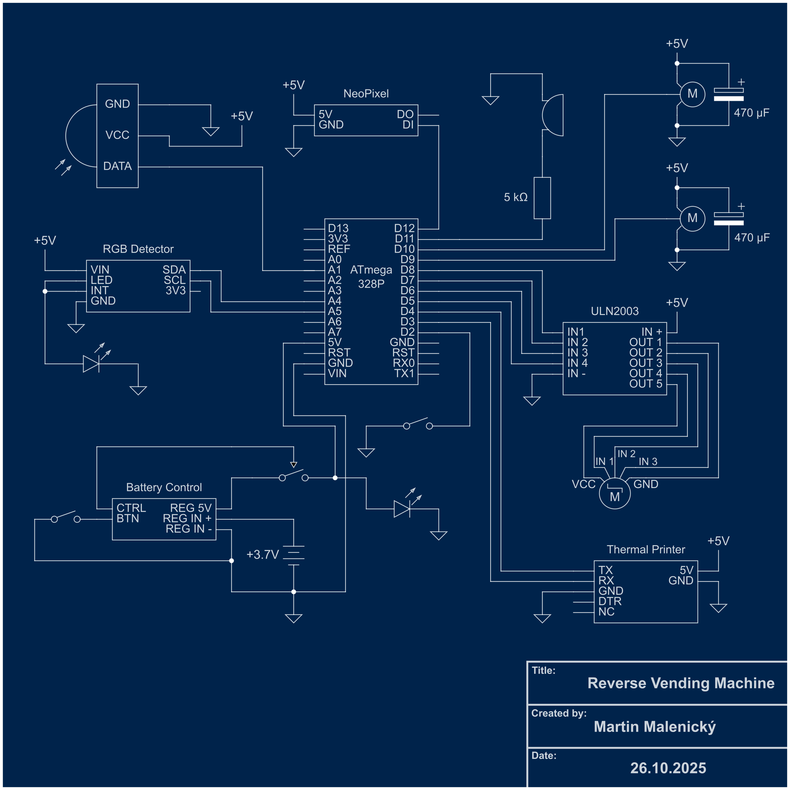

# MiniReverseVendingMachine

An Arduino-powered miniature reverse vending machine that automatically detects, conveys, and color-sorts containers. Designed as an interactive toy and multidisciplinary engineering project, it combines 3D printing, electronics, and software to mimic a real-world deposit-refund system, complete with a printed thermal receipt.

## 🎥 Project Media

* **Watch it in action:** [YouTube](https://www.youtube.com/playlist?list=PLAvx6yAmaPO_w0AlcTy81U2OP1X48eIGR)
* **3D Printable Models:** [Printables](https://www.printables.com/model/1693055-reverse-vending-machine)
## ✨ Features

* **Smart Conveyor System:** Uses a stepper motor to move items through a tunnel. The software is capable of tracking multiple bottles in the tunnel simultaneously.
* **Material Classification:** Integrates an Adafruit TCS34725 RGB sensor to read the color profile of the inserted item and classify it as a Can, Plastic, or Glass container.
* **Automated Sorting & Rejection:** Uses dual servo motors (left and right) to physically route accepted containers into their respective bins. Unrecognized items are actively rejected.
* **Interactive Feedback:** Features an Adafruit NeoPixel LED strip that displays rotating animations and color-coded status lights, along with a buzzer for audio cues.
* **Thermal Receipt Printing:** Upon pressing the finish button, the machine prints a custom receipt featuring bitmaps (logos and QR codes) and a calculated tally of all returned beverage packages.
* **Battery powered:** Runs on four 18650 USB-C rechargable batteries. Runtime is several hours of usage (sensors, motors and thermal printer running). 

## 🛠️ Hardware & Components

* **Microcontroller:** Arduino (Compatible board)
* **Sensors:**
    * Analog IR Proximity Sensor (for initial bottle detection)
    * Adafruit TCS34725 RGB Sensor
* **Actuators:**
    * 1x Stepper Motor (driven by a 4-pin controller)
    * 2x Micro Servos (for the left and right sorting gates)
* **Peripherals:**
    * Thermal Printer (communicating via SoftwareSerial)
    * Adafruit NeoPixel LED Strip
    * Passive Buzzer
    * Push Button (to end session and print receipt)
    * 18650 Battery Pack

## 💻 Software & Libraries

This project is written in C++ for the Arduino environment. It relies on the following libraries:
* Wire.h (I2C communication for the RGB sensor)
* Servo.h (Sorting gate control)
* Stepper.h (Conveyor belt control)
* SoftwareSerial.h (Printer communication)
* Adafruit_NeoPixel.h (LED strip animations)
* Adafruit_TCS34725.h (Color sensor interface)

## ⚙️ How It Works

1.  **Detection:** The system idles until the analog IR sensor detects an object breaking its threshold.
2.  **Conveying:** The stepper motor engages, moving the item forward into the tunnel. The LED strip activates a rotating animation to indicate processing.
3.  **Scanning:** Once the item reaches the RGB sensor, the conveyor pauses, the LEDs turn off to prevent light interference, and the sensor takes a reading. 
4.  **Sorting:**
    * If the color profile matches a known container (Can, PET, Glass), the item count increments, and the servos actuate to the correct position.
    * If the color is unknown, the machine flags an error and reverses the stepper motor to eject the item back to the user.
6.  **Completion:** The user presses the exterior button, triggering the ending sequence. The buzzer plays an ending tone, and the thermal printer generates a formatted receipt summarizing the session.
